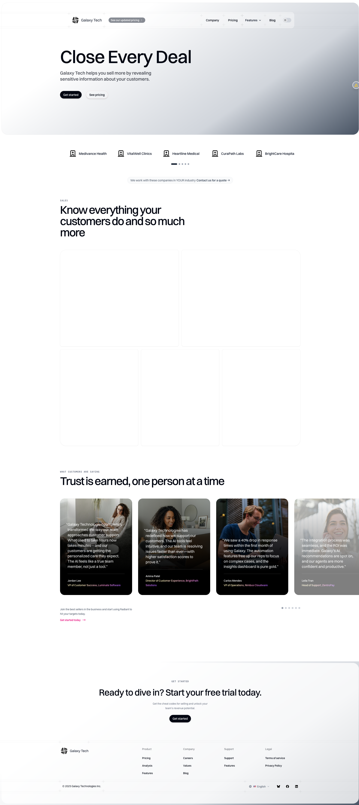

# Demo Site: Common Tasks

This guide provides step-by-step instructions for common tasks specific to the Demo Site. For generic Agility CMS workflows, see the [Generic Training Guide](../generic/README.md).

## Task: Create a New Blog Post

1. Navigate to **Content** → **Posts**
2. Click **"Add Content"** or the **"+"** button
3. Fill in the post fields:
   - **Heading**: Post title
   - **Slug**: URL-friendly identifier (auto-generated from heading)
   - **Post Date**: Publication date
   - **Content**: Rich text content
   - **Featured Image**: Upload or select from library
   - **Category**: Select from existing Categories or create new
   - **Author**: Select from existing Authors
   - **Tags**: Select multiple tags
4. Click **"Save"** to save as draft
5. Click **"Publish"** to make it live

**Result**: The blog post automatically appears on the blog listing page when published.

## Task: Update the Homepage Hero Section

1. Navigate to **Pages** → **Sitemap**
2. Click on **Home** page
3. Find the **BackgroundHero** or **PersonalizedBackgroundHero** component
4. Click to edit
5. Update fields:
   - Heading
   - Description
   - Background Image
   - CTA Button (if applicable)
6. Click **"Save"**
7. Click **"Publish"** to make changes live

## Task: Add a Testimonial

1. Navigate to **Content** → **Testimonials**
2. Click **"Add Content"**
3. Fill in testimonial fields:
   - Customer Name
   - Quote (rich text)
   - Image (customer photo)
   - Company/Title (if applicable)
4. Click **"Save"** and **"Publish"**

**Note**: The testimonial will appear in any Testimonials component that links to it.

## Task: Update Pricing Information

1. Navigate to **Content** → **Pricing Tiers**
2. Click on the pricing tier you want to update
3. Update fields:
   - Tier Name
   - Price
   - Features (list)
   - CTA Button
4. Click **"Save"** and **"Publish"**

**Note**: Changes will appear on the Pricing page automatically if the PricingCards or PricingTable component is linked to this tier.

## Task: Add Content to Bento Section

1. Navigate to **Content** → **Bento Cards**
2. Click **"Add Content"**
3. Fill in card fields:
   - Title
   - Description
   - Image
   - Link (if applicable)
4. Click **"Save"** and **"Publish"**
5. Navigate to the page with the BentoSection component
6. Edit the BentoSection component
7. Link the new Bento Card in the component's linked content field
8. Save and publish the page

## Task: Manage Authors

1. Navigate to **Content** → **Authors**
2. To add a new author:
   - Click **"Add Content"**
   - Enter Name
   - Upload Headshot Image
   - Save and publish
3. To edit an author:
   - Click on the author
   - Make changes
   - Save

**Note**: Authors are linked to blog posts. When you create a post, you can select an author from this list.

## Task: Organize Blog Posts with Categories

1. Navigate to **Content** → **Categories**
2. Create categories as needed:
   - Click **"Add Content"**
   - Enter Category Name
   - Save and publish
3. When creating/editing posts:
   - Select the appropriate Category
   - Posts will be organized by category

**Note**: The PostListing component can filter posts by category.

## Task: Upload and Use Images

1. Navigate to **Assets**
2. Browse to the appropriate folder (e.g., `images/posts`, `images/hero`)
3. Click **"Upload"** or drag and drop files
4. When editing content or components:
   - Click on an image field
   - Select **"Choose from Library"**
   - Browse and select the image
   - Add alt text for accessibility

## Task: Preview Before Publishing

1. From any page or content item editor, click **"Preview"**
2. Review how content will appear
3. Check on different device sizes if available
4. Make adjustments if needed
5. Publish when ready

## Task: Use Personalization Features

The Demo Site supports audience and region personalization:

1. Navigate to **Content** → **Audiences** or **Regions**
2. Create audience/region segments as needed
3. When editing components that support personalization:
   - Configure default content
   - Configure audience-specific content
   - Configure region-specific content
4. Content will display based on URL parameters

**Note**: Personalization is configured through components like PersonalizedBackgroundHero and PersonalizedLogoStrip.

## Best Practices for Demo Site

1. **Use linked content**: Link to Authors, Categories, and Tags rather than duplicating
2. **Organize assets**: Use folders in Assets section (images/posts, images/hero, etc.)
3. **Preview before publishing**: Always preview changes
4. **Follow naming conventions**: Use descriptive names for content items
5. **Keep content reusable**: Design content items to be used in multiple places

---

**Back to**: [Demo Site Overview](./README.md)

